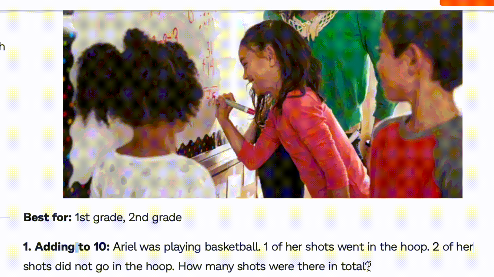
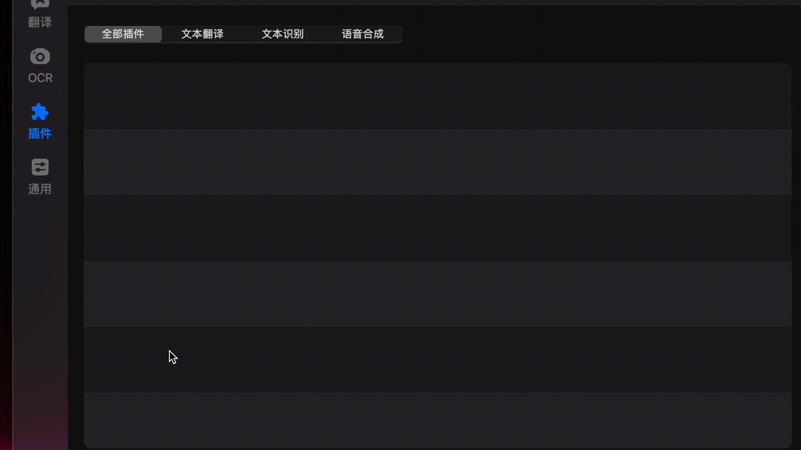
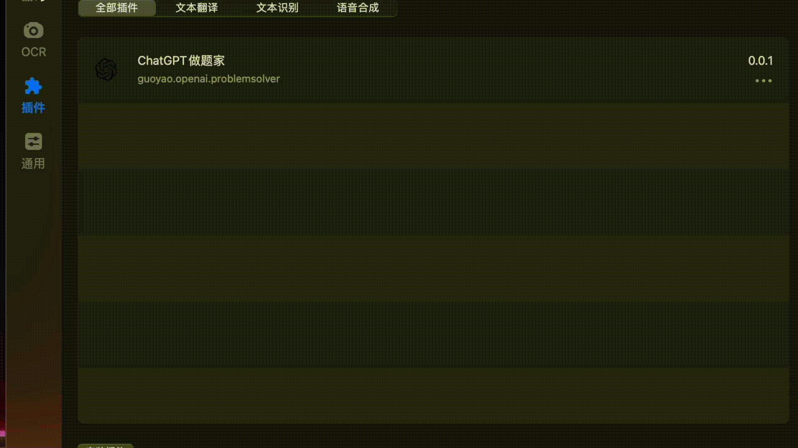

# GptSolver GPT小镇做题家
基于ChatGPT开发的做题软件
----------------------------

# 使用截图

# 简介

本插件的目的：最快最便利地利用ChatGPT解题。

划题 + 快捷键（option & D） = bingo！

# 使用方法

1. 安装 [Bob社区版](https://v0.bobtranslate.com/#/general/quickstart/install) (版本 >= 0.50)

2. 下载此插件: [GPT做题家](https://github.com/guoyaol/GptSolver/releases/download/first_version/Zuoti.bobplugin.zip)
3. 安装此插件:

4. 去 [OpenAI](https://platform.openai.com/account/api-keys) 获取你的 API KEY
5. 把 API KEY 填入 Bob 此插件配置界面的 API KEY
 输入框中

6. 划词，按下option & D，成功解题

向代码模板提供者yetone致敬
https://github.com/yetone/bob-plugin-openai-translator
